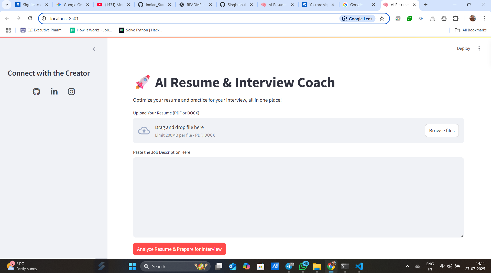
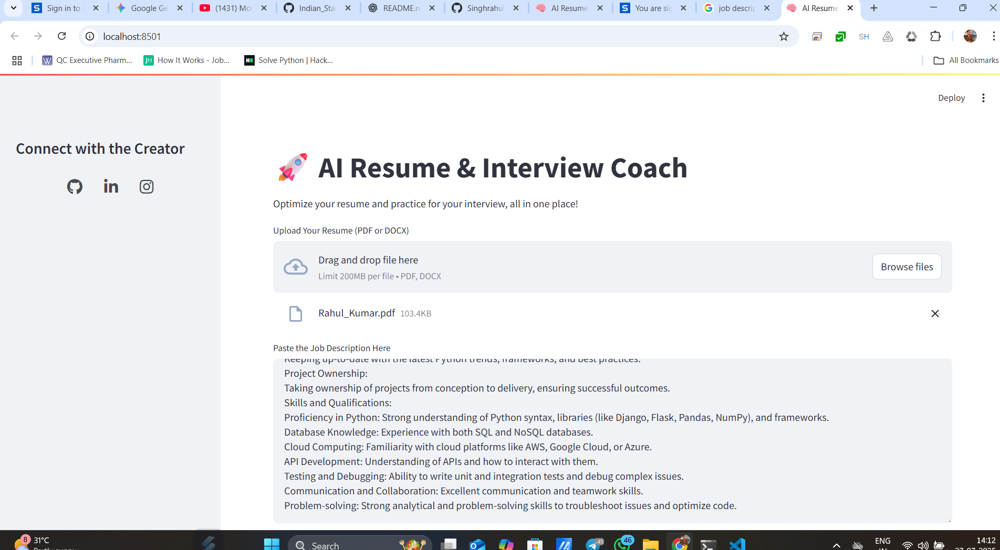
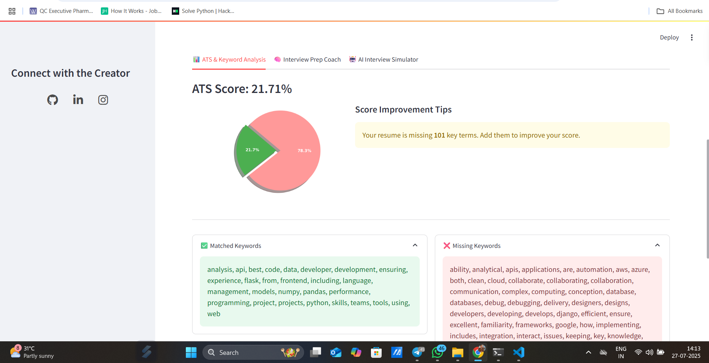
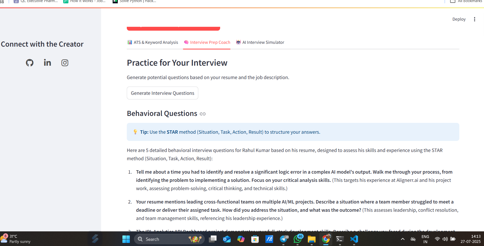
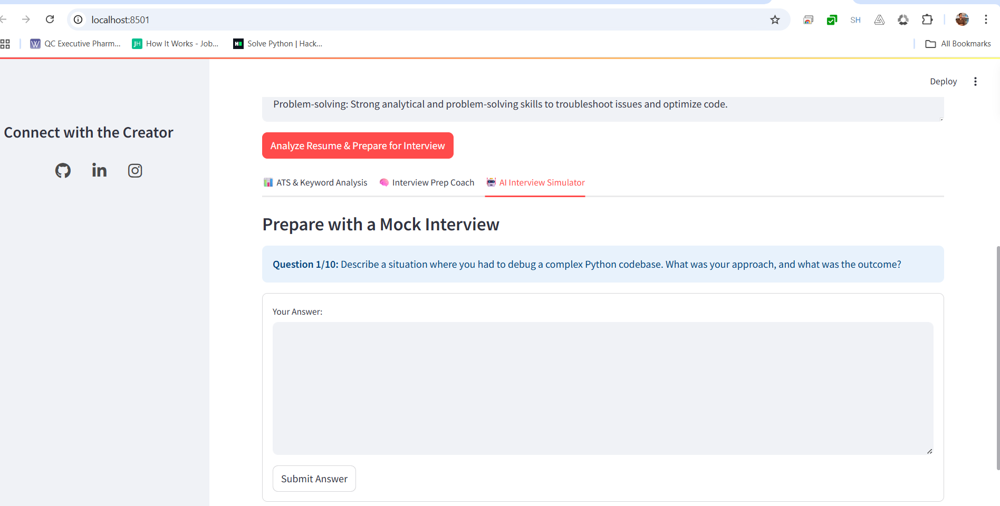

# 🚀 AI Resume & Interview Coach

This Streamlit web app helps users optimize their resume against job descriptions, practice with AI-generated questions, and run a full mock interview simulation.

---

## 📊 Features

- ✅ **ATS Resume Analysis:** Get an ATS score, see matched vs. missing keywords, and visualize the results.
- ✅ **Automated Resume Editing:** Automatically add missing keywords to your DOCX resume.
- ✅ **AI Interview Coach:** Generate behavioral and technical questions based on your resume and a job description.
- ✅ **AI Mock Interview Simulator:** Engage in a one-on-one conversational interview with an AI based on a job title.
- ✅ **Performance Summary:** Receive a final feedback report on your mock interview performance.

---

## 📁 Project Structure

```bash
📦 ai-resume-interview-coach/
├── app.py                     # Main Streamlit app file
├── requirements.txt           # Required Python packages
├── render.yaml                # Render deployment configuration
├── .gitignore                 # Files to ignore for Git
├── README.md                  # Project overview
├── resume/                    # Module for resume processing
│   ├── analyzer.py
│   ├── editor.py
│   └── extractor.py
├── interview/                 # Module for AI interview features
│   ├── coach.py
│   └── simulator.py
└── utils/                     # Utility modules
    └── visualizer.py
```

---
## 📊 Dashboard Overview



### 📊 ATS Score & Keyword Analysis


### 📈 Overview Part 2


### 🧠 AI Interview Prep Coach


### 🤖 AI Mock Interview Simulator



1. **Clone the repository**
   ```bash
   git clone https://github.com/Singhrahul2511/Indian_Startup_Analysis.git
   cd Indian_Startup_Analysis
   ```

2. **(Optional) Create a virtual environment**
   ```bash
   python -m venv venv
   venv\Scripts\activate   # For Windows
   source venv/bin/activate  # For Linux/Mac
   ```

3. **Install dependencies**
   ```bash
   pip install -r requirements.txt
   ```
4. **Run the Streamlit app**
   ```bash
   streamlit run app.py
   ```
5. **Open your browser**
    ```bash
   - App will run at `http://localhost:8501`
    ```
---

## 🌐 Live Demo

You can also check the live version here:  
🔗 [https://rahul12.streamlit.app/]

---

## 🛠️ Built With
-[Streamlit]
-[LangChain]
-[Google-Gemini]
-[python-docx]
-[PyMuPDF]
-[Matplotlib]

---


## 👨‍💻 Author

**Rahul Kumar**  
🔗 [LinkedIn](https://www.linkedin.com/in/rahul-kumar-8ab740268/)  
📧 aiwithrahul25@gmail.com  
🎥 [YouTube: AI with Rahul](https://www.youtube.com/@aiwithrahul25)

---
